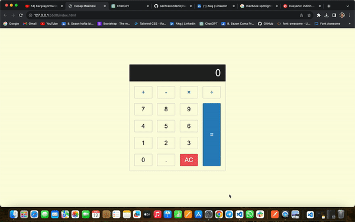

<h1>CALCULATOR</h1>

<h2> Proje Hakkında </h2>

Bu projeyi geliştirerek, temel web teknolojilerini kullanarak pratik yapma fırsatı buldum. Ayrıca, kullanıcı dostu bir arayüz tasarlamak ve temel matematiksel işlemleri gerçekleştirmek gibi becerilerimi pekiştirdim.

<h2> Kullanılan Teknolojiler </h2>

HTML
CSS
JavaScript

<h2> Tasarım Özellikleri </h2>

Temiz ve kullanıcı dostu arayüz
Temel matematiksel işlemleri gerçekleştirebilen bir hesap makinesi
İyi düzenlenmiş ve okunabilir kod yapısı

<h2> Geliştirme Süreci </h2>

HTML ile temel yapıyı oluşturdum.
CSS ile tasarımı şekillendirdim, kullanıcı deneyimini geliştirdim.
JavaScript ile hesaplama işlemlerini gerçekleştirdim.

<h2> Ekran Görüntüsü </h2>

